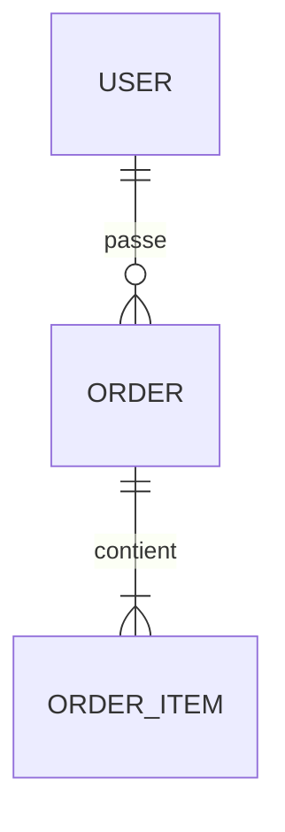

# Documentation base de données

Tous les fichiers vivent dans `.kagents/docs/base-docs/db/`.

## Règles d'écriture
- `INDEX.md` reste court (une page). C'est un sommaire, pas un rapport.
- Une fiche entité : faits, références, usages. Pas de prose.
- Une proposition = un sujet. Si elle grossit, découpe-la.
- Un audit est figé après écriture. Le suivant est un nouveau fichier.
- La carte ne contient que ce qui est observé, jamais une proposition.
- Au-delà de ~8 entités, la carte garde la vue d'ensemble et le diagramme, et le détail passe dans `entities/`.

## INDEX.md

~~~~markdown
# Base — Index

> Dernière session : <date> — Mode : <A|B|C> — Carte à jour au : <date / dernière source lue>

## Stack
- Base de données : …
- Couche d'accès : …
- Source de vérité du schéma : …
- Export Catalyst (si applicable) : <nom du fichier> — <date de l'export>

## Fichiers
- Carte : [schema-map.md](schema-map.md)
- Dernier audit : [audits/<fichier>](audits/<fichier>)
- Modèle cible (mode A) : [design/model-v1.md](design/model-v1.md)

## Propositions ouvertes
| ID | Sujet | Sévérité | Statut |
|---|---|---|---|
| PROP-001 | … | Élevée | proposée |

## Inconnus en attente
- … (ce qu'il faut demander, ou l'export Catalyst à fournir)
~~~~

## schema-map.md

~~~~markdown
# Carte du schéma

> Mise à jour : <date> — Dernière source lue : <migration / schéma / export Catalyst + date>

## Diagramme


## Entités
| Entité | Rôle métier | Fiche |
|---|---|---|
| User | … | [entities/user.md](entities/user.md) |

## Inconnus
- …

## Historique
- <date> : <ce qui a changé et pourquoi>
~~~~

## entities/<entite>.md

~~~~markdown
# <Entité>

- Rôle métier : …
- Sources : <modèle>, <migration ou export>
- Clé : …
- Attributs clés : <nom : type, contraintes> (Établi / Déduit / Inconnu)
- Index : …
- Relations : …
- Usages : création <fichier:ligne> · lecture <…> · modification <…> · suppression <…>
~~~~

## design/model-v1.md (mode A)

~~~~markdown
# Modèle cible — v1

## Besoins couverts
- …

## Type de base retenu
<choix> — <pourquoi, en une ou deux phrases>

## Diagramme
```mermaid
erDiagram
```

## Entités
<même format que les fiches entités>

## Décisions
- …

## Hypothèses
- …

## Questions ouvertes
- …
~~~~

## audits/AAAA-MM-JJ-<sujet>.md

~~~~markdown
# Audit — <sujet> — <date>

## Résumé
<3 à 5 lignes>

## Écarts contexte / repository
| Contexte dit | Repository montre | Référence |
|---|---|---|

## Problèmes
### [Critique] <titre court>
- Catégorie : …
- Preuve : <fichier:ligne ou entrée de l'export>
- Statut : Établi | Déduit
- Impact : …
- Proposition : [PROP-NNN](../proposals/PROP-NNN-<slug>.md) ou « aucune »

## Actions prioritaires
1. …

## Hypothèses retenues
- …

## Questions ouvertes
- …
~~~~

## proposals/PROP-NNN-<slug>.md

~~~~markdown
# PROP-NNN — <titre>

- Statut : proposée | acceptée | rejetée | appliquée
- Origine : audit <lien> | fonctionnalité « … »
- Créée le : <date> — Mise à jour : <date>
- Sévérité / priorité : …

## Problème ou besoin
…

## Impact
- Entités et colonnes : …
- Données existantes : …
- Code concerné : <fichier:ligne>
- Risques : …
- Contraintes de plateforme à vérifier : …

## Approche recommandée
…

## Alternative (si compromis réel)
…

## Migration
1. …
- Migration des données : …
- Retour arrière : …

## Décision
<rempli quand l'utilisateur tranche>
~~~~